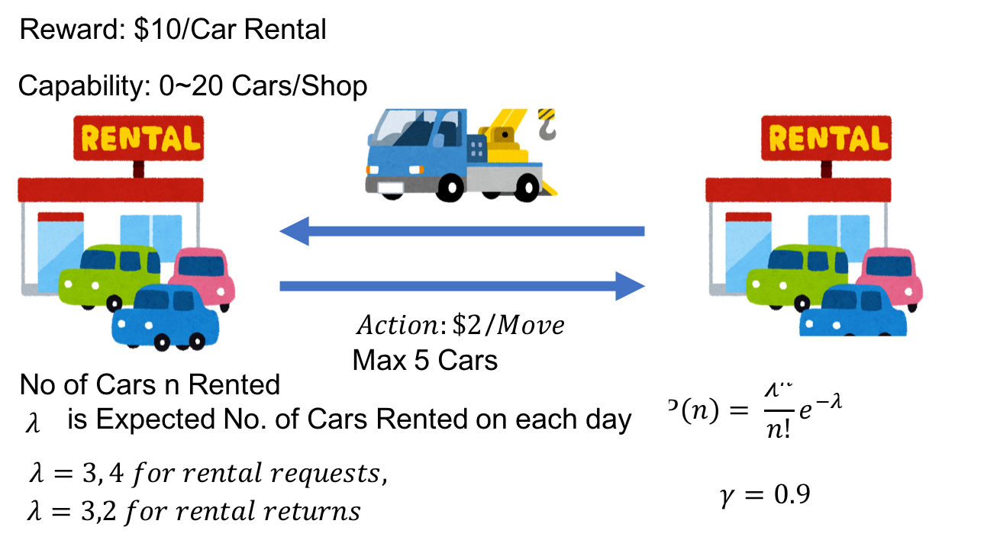

# GridWorld.py

## Problem
Assume grid on the topleft corner and bottomright corner has value of 0.
Each action takes -1 reward.
Actions are Top, Right, Bottom, Left
Probability is equiprobable random policy

Calculate Each Value for 4*4 Grid

## Solution Should be As shown in the book

## Original Code
You can pass argument to choose any grid size you want.  
run `python3 GridWorld.py -s 6` for example

#### 4*4 Grid

#### 6*6 Grid

#### 8*8 Grid

# Jack's Car Rental
## Problem

## Expected Answer

